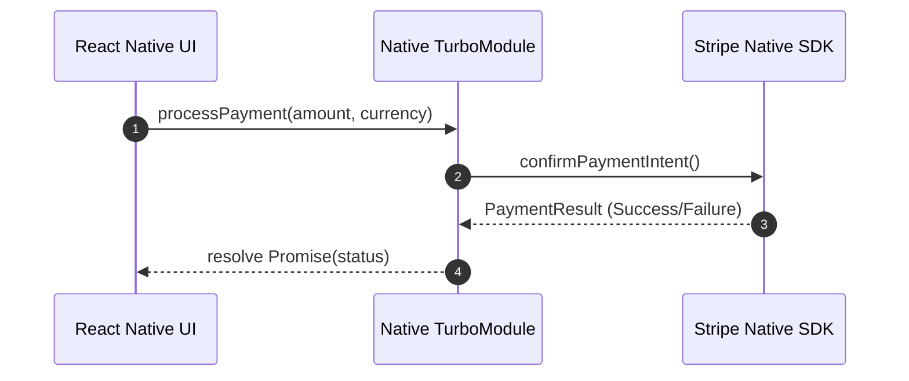

# AI workflow

### Question a1b2c3d4-e5f6-4a7b-8c9d-0e1f2a3b4c5d

- You are building a React Native app and want to use AI tools (e.g., code assistants) to speed up development. How would you ensure the generated code aligns with your app architecture and doesn’t introduce performance issues?

### Answer

- ***Custom System Prompts & Repository Rules***: Supply AI tools with repository-level context files (such as `.cursorrules`, `AGENTS.md`, or custom system prompts) detailing architectural conventions, state management patterns (e.g., Zustand vs Redux Toolkit), folder structures, and native module boundaries.
- ***Automated Architectural Linter Constraints***: Configure strict ESLint rules (e.g., `eslint-plugin-react-native`, `import/order`, `eslint-plugin-boundaries`) in CI pipelines to reject code that violates architectural boundaries (such as placing direct API calls inside presentational components).
- ***Performance Linting & Guardrails***: Enforce automated static analysis checks that forbid inline arrow functions in list `renderItem` props, mandate `@shopify/flashlist` over legacy `FlatList`, and check bundle size changes.
- ***Human-in-the-Loop Architecture Reviews***: Treat AI-generated code as a draft from a junior engineer—conduct rigorous peer code reviews focusing on component lifecycle boundaries, memory footprint, and JS/UI thread separation.

```typescript
// .cursorrules example specifying architecture constraints
{
  "rules": {
    "stateManagement": "Use Zustand for global state; prefer local useState for UI-only state",
    "listRendering": "Always use @shopify/flashlist instead of React Native FlatList",
    "styling": "Use StyleSheet.create or NativeWind tokens; no inline object styling in renders"
  }
}
```

---

### Question b2c3d4e5-f6a7-4b8c-9d0e-1f2a3b4c5d6e

- An AI tool generates a complex component with multiple hooks and side effects. What steps would you take to review and validate its correctness and efficiency?

### Answer

- ***Deconstruct Hook Hierarchy & Reactive Dependencies***: Audit every `useEffect`, `useCallback`, and `useMemo` dependency array to verify that reactive dependencies are correctly declared and free of unstable object references that trigger re-render loops.
- ***Evaluate Side Effect Lifecycle & Cleanup***: Verify that all asynchronous operations, native event listeners (`EventEmitter`), timers, and WebSocket subscriptions return explicit cleanup functions upon component unmounting to prevent native memory leaks.
- ***Analyze Thread Execution & Re-render Hotspots***: Profile the component using ***React DevTools Profiler*** and ***Hermes Sampling Profiler*** to confirm state updates are scoped and expensive computations are offloaded to native worklets or memoized.
- ***Refactor into Single-Responsibility Custom Hooks***: Extract complex AI-generated multi-hook logic out of the presentation layer into modular custom hooks (e.g., `useDataFetching`, `useFormValidation`) to enable isolated unit testing.

```typescript
import { useEffect, useState } from 'react';
import { NativeEventEmitter, NativeModules } from 'react-native';

// Validating side-effect cleanup in AI-generated custom hook
export const useNativeSensor = () => {
  const [data, setData] = useState<SensorData | null>(null);

  useEffect(() => {
    const { SensorModule } = NativeModules;
    const emitter = new NativeEventEmitter(SensorModule);
    
    // Explicit subscription setup
    const subscription = emitter.addListener('onSensorChange', (event: SensorData) => {
      setData(event);
    });

    // Mandatory cleanup function to prevent memory leaks on unmount
    return () => {
      subscription.remove();
    };
  }, []); // Empty dependency array ensures listener attaches once

  return data;
};
```

---

### Question c3d4e5f6-a7b8-4c9d-0e1f-2a3b4c5d6e7f

- How would you use AI to help debug a production-only crash in a React Native app without exposing sensitive user data?

### Answer

- ***Local Sanitization & Data Anonymization***: Scrub all personally identifiable information (PII), authentication tokens, user IDs, and proprietary API payloads from stack traces and breadcrumbs using local regex scripts before submitting inputs to LLMs.
- ***Symbolicated Stack Trace Contextualization***: Feed sanitized native stack traces (Android ProGuard/R8 `mapping.txt` or iOS dSYM symbolicated traces) alongside minified React Native JS bundle offsets to AI tools for root-cause diagnosis.
- ***Differential Frame & Engine Analysis***: Prompt AI to analyze differential behavior across mobile execution environments—such as Hermes JS Engine vs JavaScriptCore memory layouts, native bridge serialization boundaries, or OS-specific native crashes.
- ***Zero-Data-Retention & Local LLM Execution***: Utilize enterprise AI APIs with strict zero-data-retention agreements, or leverage locally hosted LLMs (e.g., Ollama running Llama-3 locally) for analyzing sensitive crash logs offline.

```typescript
// Example Sentry beforeSend scrubber script for local stack sanitization
const sanitizeCrashLog = (crashLog: string): string => {
  return crashLog
    .replace(/[a-zA-Z0-9._%+-]+@[a-zA-Z0-9.-]+\.[a-zA-Z]{2,}/g, '[REDACTED_EMAIL]')
    .replace(/Bearer\s+[A-Za-z0-9\-\._~\+\/]+=*/g, 'Bearer [REDACTED_TOKEN]')
    .replace(/"user_id":\s*"\d+"/g, '"user_id": "[REDACTED_ID]"');
};
```

---

### Question d4e5f6a7-b8c9-4d0e-1f2a-3b4c5d6e7f8a

- You rely on AI to generate API integration code. How would you verify that error handling, retries, and edge cases are properly covered?

### Answer

- ***Audit HTTP & Network Exception Branching***: Verify that generated code differentiates between network offline errors (`TypeError: Network request failed`), 4xx client errors (e.g., 401 Unauthorized, 429 Rate Limited), and 5xx server failures rather than using a single catch block.
- ***Exponential Backoff with Jitter***: Confirm that automated retry logic incorporates ***Exponential Backoff with Full Jitter*** to prevent server thundering herd problems during backend recoveries.
- ***Idempotency Headers & AbortController Signals***: Ensure mutating API requests (POST/PUT/DELETE) supply unique idempotency keys, and read requests attach `AbortController` signals to cancel inflight requests when screens unmount.
- ***Mock-Driven Edge Case Testing***: Validate resilience using mock servers (MSW or `axios-mock-adapter`) that simulate slow connection dropouts, partial JSON responses, and offline transitions via `@react-native-community/netinfo`.

```typescript
import axios, { AxiosError } from 'axios';

// AI Integration verification: Exponential backoff & request cancellation
export const fetchUserData = async (userId: string, signal: AbortSignal, retries = 3) => {
  let attempt = 0;
  while (attempt < retries) {
    try {
      const response = await axios.get(`/api/users/${userId}`, { signal });
      return response.data;
    } catch (error) {
      const axiosError = error as AxiosError;
      // Do not retry on 4xx client errors or aborted signals
      if (signal.aborted || (axiosError.response && axiosError.response.status < 500)) {
        throw error;
      }
      attempt++;
      if (attempt >= retries) throw error;
      // Exponential backoff delay with jitter
      const delay = Math.pow(2, attempt) * 1000 + Math.random() * 200;
      await new Promise((res) => setTimeout(res, delay));
    }
  }
};
```

---

### Question e5f6a7b8-c9d0-4e1f-2a3b-4c5d6e7f8a9b

- AI suggests using a certain library for handling video playback in your app. How would you evaluate whether it fits your performance and scalability requirements?

### Answer

- ***Native Architecture & Engine Compatibility***: Confirm whether the library relies on modern platform-native players (`ExoPlayer` / `Media3` on Android, `AVPlayer` on iOS) and supports React Native’s ***New Architecture (Fabric & TurboModules)***.
- ***Memory & Buffer Management Profile***: Profile native RAM consumption, texture allocations, and native surface view recycling when scrubbing through media feeds or initializing multiple player instances.
- ***Adaptive Streaming & Caching Support***: Evaluate built-in support for HTTP Live Streaming (HLS), Dynamic Adaptive Streaming over HTTP (DASH), adaptive bitrate (ABR) rendering, and local disk chunk caching.
- ***Community Health & Low-End Hardware Benchmarks***: Inspect issue resolution velocity, native dependency updates, and benchmark video playback stability on low-end Android devices.

```typescript
import React, { useEffect, useRef } from 'react';
import Video, { VideoRef } from 'react-native-video';

// Verification pattern: Ensuring resource release on player unmount
export const ScalableVideoPlayer = ({ sourceUri }: { sourceUri: string }) => {
  const videoRef = useRef<VideoRef>(null);

  useEffect(() => {
    return () => {
      // Ensure native media player resources are freed upon screen transition
      videoRef.current?.dismissFullscreenPlayer();
    };
  }, []);

  return (
    <Video
      ref={videoRef}
      source={{ uri: sourceUri }}
      paused={false}
      resizeMode="cover"
      bufferConfig={{
        minBufferMs: 15000,
        maxBufferMs: 50000,
        bufferForPlaybackMs: 2500,
        bufferForPlaybackAfterRebufferMs: 5000,
      }}
    />
  );
};
```

---

### Question f6a7b8c9-d0e1-4f2a-3b4c-5d6e7f8a9b0c

- How would you use AI to analyze and optimize a slow-rendering screen in React Native?

### Answer

- ***Feed Structured Profiler Traces to AI***: Capture performance logs using ***React DevTools Profiler*** (flame charts, commit durations) and ***Hermes Sampling Profiler*** (`.cpuprofile`), providing raw trace data to AI for bottleneck analysis.
- ***Identify Unnecessary Sub-tree Invalidations***: Prompt AI to inspect component trees for prop instabilities (such as inline objects, anonymous callbacks, or context provider value re-creations) triggering cascading re-renders.
- ***Offload UI Thread Animations to Worklets***: Have AI rewrite JS thread layout animations using ***React Native Reanimated Worklets*** or native driver transitions to keep interaction frame rates at 60 FPS.
- ***Empirical Benchmark Verification***: Benchmark frame render times (Time to Interactive, JS frame drops) before and after applying AI optimizations using `performance.now()` or native performance markers.

```typescript
import React, { memo } from 'react';
import Animated, { useAnimatedStyle, SharedValue } from 'react-native-reanimated';

interface CardProps {
  translationX: SharedValue<number>;
}

// AI Optimization pattern: Offloading animations to UI thread via Reanimated worklets
export const OptimizedCard = memo(({ translationX }: CardProps) => {
  const animatedStyle = useAnimatedStyle(() => ({
    transform: [{ translateX: translationX.value }], // Executed natively on UI thread
  }));

  return <Animated.View style={[styles.card, animatedStyle]} />;
});
```

---

### Question a7b8c9d0-e1f2-4a3b-5c6d-7e8f9a0b1c2d

- AI generates a solution that stores large files (images/videos) in memory before upload. What red flags would you look for, and how would you correct it?

### Answer

- ***Identify In-Memory Red Flags***: Detect calls to `FileReader.readAsDataURL()`, `fs.readFile()` returning raw Base64 strings in JS memory, or storing raw file buffers in React `useState` / `ArrayBuffer`.
- ***JS Heap Inflation & Out-Of-Memory (OOM) Crashes***: Base64 encoding inflates raw file size by ~33%, causing heavy garbage collection (GC) pauses on the JS thread and triggering OS-level memory termination (OOM crashes) on lower-end devices.
- ***Stream-Based URI Uploads***: Refactor the implementation to stream files directly from native storage paths (`file://` URIs) using native network libraries like `react-native-blob-util` or `expo-file-system`.
- ***Background Native Upload Services***: For large video uploads, integrate background transfer services (such as `react-native-background-upload`) to allow uploads to persist across app backgrounding or app restarts.

```typescript
import Upload from 'react-native-background-upload';

// Corrected pattern: Streaming file directly from file URI without loading into JS memory
export const uploadLargeVideo = async (fileUri: string, uploadUrl: string) => {
  const options = {
    url: uploadUrl,
    path: fileUri, // Direct file path reference
    method: 'POST',
    type: 'raw',
    headers: {
      'content-type': 'video/mp4',
    },
    notification: {
      enabled: true,
    },
  };

  const uploadId = await Upload.startUpload(options);
  return uploadId;
};
```

---

### Question b8c9d0e1-f2a3-4b4c-6d7e-8f9a0b1c2d3e

- How can AI assist in identifying unnecessary re-renders or inefficient state management in a React Native app?

### Answer

- ***Analyze `why-did-you-render` & Profiler Output***: Supply AI with telemetry logs generated by `@welldone-software/why-did-you-render` or React DevTools render cause summaries to identify why props changed.
- ***Context Splitting & Atomic Selectors***: Prompt AI to detect monolithic React Context implementations where unrelated state updates force re-renders across all consumer components, recommending context splitting or atomic state stores (Zustand, Jotai).
- ***Detect Unstable Callback & Object Dependencies***: Direct AI to inspect component prop signatures for un-memoized object literals, array instantiations, or inline callbacks that break React `memo` memoization.
- ***State Colocation & Derived State Audit***: Identify state duplicated across multiple hierarchy levels or computed values stored needlessly in React `useState` instead of calculated inline or memoized via `useMemo`.

```typescript
import { create } from 'zustand';

interface AppState {
  user: User | null;
  theme: string;
}

const useStore = create<AppState>()((set) => ({
  user: null,
  theme: 'dark',
}));

// Efficient atomic state consumption: Component re-renders ONLY when user changes
export const UserProfile = () => {
  const user = useStore((state) => state.user); // Atomic selector avoids re-renders on theme change
  return <Text>{user?.name}</Text>;
};
```

---

### Question c9d0e1f2-a3b4-4c5d-7e8f-9a0b1c2d3e4f

- You use AI to refactor legacy React Native code. How would you ensure that behavior remains unchanged while improving code quality?

### Answer

- ***Establish Characterization Test Suite First***: Write snapshot tests (`react-test-renderer`) and behavioral integration tests (`@testing-library/react-native`) capturing legacy component outputs and interactions BEFORE initiating AI refactoring.
- ***Incremental & Micro-Refactoring Prompts***: Prompt AI to perform targeted micro-refactoring steps (such as converting class components to functional components, or replacing `ListView` with `@shopify/flashlist`) rather than re-writing entire modules at once.
- ***Static Typing & Interface Verification***: Enforce strict TypeScript types and strict null checks on component props and API payloads to catch structural contract breakages during refactoring.
- ***Automated Visual & E2E Regression Testing***: Run automated visual regression tests and end-to-end user flow smoke tests (using Detox or Maestro) across both iOS and Android simulators.

```typescript
import { render, fireEvent } from '@testing-library/react-native';
import { LegacyButton } from '../components/LegacyButton';

// Characterization test to preserve legacy behavior during AI refactoring
test('preserves click handler and disabled behavior during refactor', () => {
  const onPressMock = jest.fn();
  const { getByText } = render(<LegacyButton title="Submit" onPress={onPressMock} disabled={false} />);
  
  fireEvent.press(getByText('Submit'));
  expect(onPressMock).toHaveBeenCalledTimes(1);
});
```

---

### Question d0e1f2a3-b4c5-4d6e-8f9a-0b1c2d3e4f5a

- How would you integrate AI into your development workflow for writing tests (unit, integration, e2e) in a mobile app?

### Answer

- ***Automated Unit Test Scaffolding***: Use AI CLI/IDE tools to inspect component code or custom hooks and automatically generate Jest unit test skeletons covering happy paths, error states, and edge cases.
- ***Declarative Mobile E2E Test Scripting***: Feed user stories or UI hierarchy trees to AI to generate declarative ***Maestro YAML*** or ***Detox*** end-to-end automation scripts targeting accessibility identifiers (`testID`).
- ***Type-Safe Mock Dataset Generation***: Prompt AI to generate realistic mock datasets and factory functions (using `msw` or `fishery`) for offline state testing and API contract mocking.
- ***CI-Integrated Coverage Auditing***: Configure AI bots in pull requests to analyze git diffs, highlight untested branch logic, and suggest missing test cases.

```yaml
# AI-generated Maestro E2E test script (flows/login.yaml)
appId: com.example.app
---
- launchApp
- tapOn:
    id: "login_email_input"
- inputText: "user@example.com"
- tapOn:
    id: "login_password_input"
- inputText: "SecurePass123!"
- tapOn:
    id: "login_submit_button"
- assertVisible:
    id: "dashboard_welcome_header"
```

---

### Question e1f2a3b4-c5d6-4e7f-9a0b-1c2d3e4f5a6b

- AI suggests changes to improve performance, but they make the code harder to maintain. How would you balance AI recommendations with long-term maintainability?

### Answer

- ***Profile Before Micro-Optimizing***: Never accept complex AI micro-optimizations (such as manual bitwise operations or complex ref caching) without empirical profiler proof showing a measurable frame rendering bottleneck (>16ms drop).
- ***Encapsulate Low-Level Performance Hacks***: If complex performance techniques are necessary (e.g. low-level Native Module bridges or Reanimated worklet math), isolate them inside encapsulated, well-documented custom hooks or internal helper modules.
- ***Enforce Code Readability Standards***: Prioritize clean architecture, standard idiomatic React patterns, and developer ergonomics over negligible performance gains that obscure code intent.
- ***Mandate Inline Architectural Rationale***: Require inline code comments and Architectural Decision Records (ADR) whenever non-obvious performance optimizations from AI suggestions are merged.

```typescript
// Encapsulating complex AI performance optimization inside a clean custom hook
export const useOptimizedScrollOffset = () => {
  // Complex worklet logic hidden behind a clean custom hook interface
  const scrollOffset = useSharedValue(0);
  const scrollHandler = useAnimatedScrollHandler({
    onScroll: (event) => {
      'worklet';
      scrollOffset.value = event.contentOffset.y; // Isolated low-level worklet execution
    },
  });

  return { scrollOffset, scrollHandler };
};
```

---

### Question f2a3b4c5-d6e7-4f8a-0b1c-2d3e4f5a6b7c

- How would you prevent over-reliance on AI when designing critical parts of a mobile app (e.g., authentication, payments)?

### Answer

- ***Human-Led Architecture & Threat Modeling***: Design core payment workflows and authentication security architectures manually using formal threat modeling frameworks (e.g., STRIDE) and vetted platform SDKs (such as Stripe SDK or native Keychain/Keystore wrappers).
- ***Restrict AI Scope to Non-Critical Boilerplate***: Limit AI assistance in security-sensitive modules to generating static type definitions, mock data for tests, and UI form layouts rather than auth state orchestration.
- ***Mandatory Senior Security Reviews***: Require mandatory code reviews by senior mobile architects and security specialists for any pull request modifying token storage, biometric handlers, or payment webhooks.
- ***Automated Security & Compliance Auditing***: Run static application security testing (SAST with SonarQube or MobSF) and dynamic analysis to confirm secure token storage in `react-native-keychain` and TLS certificate pinning.

```typescript
import * as Keychain from 'react-native-keychain';

// Vetted manual security implementation for auth token storage
export const storeAuthToken = async (token: string) => {
  await Keychain.setGenericPassword('authToken', token, {
    service: 'com.app.auth',
    accessible: Keychain.ACCESSIBLE.WHEN_UNLOCKED_THIS_DEVICE_ONLY,
    securityLevel: Keychain.SECURITY_LEVEL.SECURE_HARDWARE, // Requires hardware-backed KeyStore/Secure Enclave
  });
};
```

---

### Question a3b4c5d6-e7f8-4a9b-1c2d-3e4f5a6b7c8d

- AI-generated code introduces a subtle bug related to async state updates. How would you systematically identify and fix it?

### Answer

- ***Trace Stale Closures & Asynchronous Timing***: Inspect async callbacks (Promises, `async/await`, event handlers) to identify stale state closures where variables capture outdated state at call time rather than reading current values.
- ***Functional State Updates & Mutable References***: Replace direct state dispatches with functional updates `setState(prev => ...)` or maintain mutable references using `useRef` for values accessed inside long-running async callbacks.
- ***Enforce Cancellation & Unmount Guardrails***: Integrate `AbortController` signals or unmount flags to prevent setting state on unmounted component trees.
- ***Leverage React StrictMode & Linter Rules***: Enable React `StrictMode` in development builds to expose side-effect timing defects, and enforce `react-hooks/exhaustive-deps` ESLint rules.

```typescript
import { useState, useEffect, useRef } from 'react';

// Systematic fix: Using AbortController and functional state updates to eliminate async timing bugs
export const useAsyncData = (dataId: string) => {
  const [data, setData] = useState<Data | null>(null);

  useEffect(() => {
    const controller = new AbortController();

    const loadData = async () => {
      try {
        const result = await fetchApiData(dataId, controller.signal);
        // Functional update guarantees operating on current state instance
        setData(() => result);
      } catch (err) {
        if (!controller.signal.aborted) {
          // Handle error safely if request was not cancelled
        }
      }
    };

    loadData();

    // Abort inflight request on dataId change or screen unmount
    return () => controller.abort();
  }, [dataId]);

  return data;
};
```

---

### Question b4c5d6e7-f8a9-4b0c-2d3e-4f5a6b7c8d9e

- How would you use AI to generate documentation for complex mobile features while ensuring accuracy?

### Answer

- ***Supply Source-of-Truth Context***: Provide LLMs with complete source files—including TypeScript interfaces, custom hooks, native module bindings, and state machine definitions—rather than high-level text descriptions.
- ***Generate Visual Sequence & Flow Diagrams***: Prompt AI to output GitHub-Flavored Markdown combined with ***Mermaid.js sequence diagrams*** to illustrate data flows between the JS thread, Native Modules, and backend services.
- ***Automated Doc Validation via TypeScript AST***: Implement CI scripts that parse AI-generated documentation code blocks and compare documented prop types, parameter lists, and function signatures against the live TypeScript AST.
- ***Co-located Engineering Maintenance***: Treat documentation as code—require code owners to review AI-generated docs in pull requests and keep docs co-located inside feature subdirectories.

```markdown
### Payment Flow Architecture


```

---

### Question c5d6e7f8-a9b0-4c1d-3e4f-5a6b7c8d9e0f

- AI tools can suggest UI/UX improvements. How would you validate these suggestions in the context of mobile constraints (screen size, performance, accessibility)?

### Answer

- ***Cross-Device & Safe Area Responsive Audits***: Test suggested layouts across varying mobile screen ratios, dynamic font scaling settings (iOS Dynamic Type / Android Font Scale), and notch boundaries using `react-native-safe-area-context`.
- ***Touch Target & Interaction Feedback Audit***: Verify interactive components comply with minimum touch target guidelines (48x48dp on Android, 44x44pt on iOS) and offer immediate visual feedback without touch delay.
- ***Mobile Accessibility (a11y) Verification***: Validate screen reader compatibility (VoiceOver / TalkBack), color contrast ratios, and verify presence of `accessible={true}`, `accessibilityLabel`, `accessibilityRole`, and `accessibilityState` props.
- ***GPU Overdraw & Layout Thrashing Profile***: Profile proposed visual enhancements (such as multi-layered dynamic shadows or real-time blurs) for GPU overdraw and layout calculation bottlenecks on budget mobile hardware.

```typescript
import React from 'react';
import { Pressable, Text, StyleSheet } from 'react-native';

// Validating AI UI suggestion: Enforcing touch target, safe area, and accessibility standards
export const AccessibleButton = ({ label, onPress }: { label: string; onPress: () => void }) => (
  <Pressable
    onPress={onPress}
    accessible={true}
    accessibilityRole="button"
    accessibilityLabel={label}
    style={({ pressed }) => [
      styles.button,
      pressed && styles.pressedState,
    ]}
  >
    <Text style={styles.text}>{label}</Text>
  </Pressable>
);

const styles = StyleSheet.create({
  button: {
    minWidth: 48, // Complies with Android/iOS touch target guidelines
    minHeight: 48,
    justifyContent: 'center',
    alignItems: 'center',
    backgroundColor: '#0066CC',
    borderRadius: 8,
  },
  pressedState: {
    opacity: 0.8,
  },
  text: {
    color: '#FFFFFF',
    fontSize: 16,
  },
});
```

---

### Question d6e7f8a9-b0c1-4d2e-4f5a-6b7c8d9e0f1a

- How would you use AI to assist in analyzing crash logs and grouping similar issues in a React Native app?

### Answer

- ***Extract & Normalize Crash Signatures***: Extract raw error telemetry from crash reporting tools (Sentry, Crashlytics, Bugsnag), stripping environment-specific memory addresses and grouping by core stack frame signatures.
- ***Disambiguate JS vs Native Bridge Crashes***: Prompt AI to correlate React Native JavaScript exceptions with underlying native thread stack traces (such as iOS `EXC_BAD_ACCESS` or Android `NullPointerException` inside Native Modules).
- ***Pattern Recognition & Release Regression Tagging***: Leverage LLMs to cluster crash surges following new releases, categorizing incidents by React Native core version, OS version, or device SoC architecture.
- ***Automated Triage & Contextual Issue Linking***: Feed symbolicated stack traces to AI to generate concise triage summaries and cross-reference open GitHub issues or repository PRs.

```typescript
// AI Prompt template for crash signature classification
const promptTemplate = `
Analyze the following React Native crash trace and output a JSON categorization:
1. Crash Type: [JS_THREAD | NATIVE_IOS | NATIVE_ANDROID | BRIDGE_SERIALIZATION]
2. Root Cause Summary: Concise explanation
3. Affected Native Module: Module name if applicable

Crash Log:
${sanitizedCrashLog}
`;
```

---

### Question e7f8a9b0-c1d2-4e3f-5a6b-7c8d9e0f1a2b

- AI suggests optimizing a list rendering using a different approach (e.g., virtualization). How would you benchmark and validate the improvement?

### Answer

- ***Define Core Performance Benchmarks***: Measure specific performance metrics: Scroll FPS (JS and UI thread stability at 60 FPS), Time to First Item Render, Blank Space Ratio during fast scrolling, and RAM consumption delta.
- ***Empirical Measurement Instrumentation***: Use ***FlashList Benchmark Utilities***, ***React Native Performance Monitor***, or native profiling tools (Xcode Instruments / Android Profiler) under heavy datasets (e.g., 5,000+ items).
- ***Low-End Physical Device Testing***: Run automated scroll stress tests on real low-end Android hardware rather than high-performance desktop simulators.
- ***A/B Feature Flag Rollout***: Deploy the virtualized list implementation behind a feature flag (e.g. LaunchDarkly) to monitor real-user monitoring (RUM) metrics and crash rates in production.

```typescript
import React, { useCallback } from 'react';
import { FlashList } from '@shopify/flashlist';
import { Text, View } from 'react-native';

// Validating AI suggestion: FlashList with explicit estimatedItemSize benchmarking
export const VirtualizedList = ({ data }: { data: Array<{ id: string; title: string }> }) => {
  const renderItem = useCallback(({ item }: { item: { id: string; title: string } }) => (
    <View style={{ height: 60 }}>
      <Text>{item.title}</Text>
    </View>
  ), []);

  return (
    <FlashList
      data={data}
      renderItem={renderItem}
      estimatedItemSize={60} // Crucial for FlashList layout calculations & memory recycling
      keyExtractor={(item) => item.id}
    />
  );
};
```

---

### Question f8a9b0c1-d2e3-4f4a-6b7c-8d9e0f1a2b3c

- How would you ensure that AI-generated code does not introduce security vulnerabilities in a mobile app?

### Answer

- ***Prevent Insecure Local Storage Practices***: Reject AI suggestions that store authentication tokens, encryption keys, or sensitive user data in unencrypted storage (`AsyncStorage` or unencrypted `MMKV`); enforce `react-native-keychain` or EncryptedSharedPreferences.
- ***Automated Static Application Security Testing (SAST)***: Integrate SAST tools (SonarQube, Semgrep, MobSF) in CI pipelines to scan AI-generated code for hardcoded secrets, unsafe regex patterns, and insecure network configurations.
- ***Sanitization & Code Execution Guardrails***: Ensure code sanitizes user input against XSS/injection attacks and avoids dynamic evaluation primitives (`eval()`, `new Function()`, or untrusted `WebView` bridge injections).
- ***SSL Pinning & Secure Transport Configuration***: Enforce strict HTTPS communication, SSL certificate pinning, and platform network security configs on iOS and Android.

```typescript
import WebView from 'react-native-webview';

// Security validation: Preventing arbitrary JS injection in AI-generated WebView integration
export const SecureWebContainer = ({ uri }: { uri: string }) => (
  <WebView
    source={{ uri }}
    allowFileAccess={false} // Prevents local file system access vulnerability
    allowUniversalAccessFromFileURLs={false}
    javaScriptEnabled={true}
    onMessage={(event) => {
      // Validate origin before processing window.postMessage payloads
      if (event.nativeEvent.origin !== 'https://trusted-domain.com') {
        return;
      }
      handleSecureMessage(event.nativeEvent.data);
    }}
  />
);
```

---

### Question a9b0c1d2-e3f4-4a5b-7c8d-9e0f1a2b3c4d

- AI generates multiple alternative implementations for a feature. How would you evaluate and choose the best one?

### Answer

- ***Multi-Criteria Evaluation Matrix***: Score implementation candidates against clear technical criteria: correctness, architecture alignment, thread performance impact, maintainability, testability, and edge-case coverage.
- ***Thread & Memory Overhead Evaluation***: Analyze how each option impacts JS/UI thread execution, native bridge serialization overhead, and memory allocations during state transitions.
- ***Cyclomatic Complexity & Testability Assessment***: Measure code complexity using static analysis tools, choosing options with clean separation of concerns that can be unit-tested without complex mocking.
- ***Profiler Micro-Benchmarking***: Run micro-benchmarks (`console.time` / profiler trace) across candidates on physical devices to select the approach with empirical performance backing.

```typescript
// Candidate evaluation summary comment embedded during review
/*
 * Candidate Evaluation for Location Tracker:
 * - Option A: Polling via setInterval in JS (Rejected: Causes JS thread wakeups, battery drain)
 * - Option B: Native Location Manager via Reanimated SharedValues (Selected: Zero JS thread overhead, clean cleanup)
 */
```

---

### Question b0c1d2e3-f4a5-4b6c-8d9e-0f1a2b3c4d5e

- How would you incorporate AI into code review processes without reducing human oversight and code quality?

### Answer

- ***AI as First-Pass Automated Inspector***: Configure AI bots (e.g. Coderabbit, GitHub Copilot PR Reviewer) to perform initial sanity checks—detecting missing type definitions, style violations, and basic edge-case oversights.
- ***Mandatory Human Engineering Approval***: Treat AI PR review outputs as non-binding feedback; enforce mandatory review and approval by at least one human domain expert before merging code into main branches.
- ***Shift Human Focus to Architectural Intent***: Utilize AI automated summaries to free human reviewers to focus on high-level system design, domain business logic correctness, security trade-offs, and user experience.
- ***Continuous AI Prompt & Rule Tuning***: Audit AI review feedback regularly; update repository lint rules and prompt definitions (`AGENTS.md`, `.cursorrules`) to minimize false positives and improve review accuracy.

```markdown
<!-- Pull Request Template with AI Pre-Review Checklist -->
## PR Review Checklist

### Automated AI Pre-Review Status
- [x] Static Analysis & Type Check Passed
- [x] No Unencrypted Storage Usage Detected
- [x] AI Test Coverage Suggestion Evaluated

### Human Reviewer Verification (Mandatory)
- [ ] Architecture matches team conventions
- [ ] Profiled on physical iOS & Android devices
- [ ] Approved by Mobile Tech Lead
```

---

### Question c1a2b3c4-d5e6-4f7a-8b9c-0d1e2f3a4b5c

- You are using a test harness to validate a complex React Native component with multiple async states (loading, success, error). How would you design the harness to reliably simulate and verify each state?

### Answer

- ***Controlled Deferred Promise Controller***: Construct a test harness wrapper using deferred promise controls (such as `createDeferredPromise()`) that exposes manual `resolve()` and `reject()` triggers to step through async states deterministically.
- ***Mock Service Worker (MSW) State Handlers***: Integrate MSW handlers that accept dynamic state flags, allowing tests to switch HTTP responses from pending delays to mock data or 500 server errors on command.
- ***Async UI State Assertions***: Utilize `@testing-library/react-native` (RNTL) `findBy*` queries and `waitFor` utilities to assert loading spinners (`ActivityIndicator`), success data lists, and error fallback UI states.
- ***State Machine Isolation***: Wrap components inside custom harness providers that log internal state transitions, catching invalid state jumps (e.g. transitioning directly from error back to uninitialized state).

```typescript
// Deferred promise helper pattern for deterministic async state harness testing
export const createDeferredPromise = <T>() => {
  let resolve!: (value: T | PromiseLike<T>) => void;
  let reject!: (reason?: any) => void;
  const promise = new Promise<T>((res, rej) => {
    resolve = res;
    reject = rej;
  });
  return { promise, resolve, reject };
};
```

---

### Question d2b3c4d5-e6f7-4a8b-9c0d-1e2f3a4b5c6d

- In a mobile app with frequent API failures, how would you build a harness to simulate network conditions (timeouts, slow responses, partial data) for testing UI behavior?

### Answer

- ***Network Interception Middleware Scaffolding***: Build a network test harness using ***Mock Service Worker (MSW)*** or Axios interceptors that inject artificial network profiles (high latency, 0% bandwidth, packet loss).
- ***Artificial Latency & Timeout Injection***: Expose harness controls to inject customizable delays (e.g. 10,000ms delay) to trigger application HTTP request timeouts and verify loading placeholder transitions.
- ***Malformed & Partial JSON Payload Generators***: Simulate edge-case response failures by returning truncated JSON strings, unexpected null fields, or malformed data structures to ensure component resilience.
- ***NetInfo Offline State Toggle***: Mock `@react-native-community/netinfo` inside the harness to trigger offline banner displays and test local offline queue caching behavior.

```typescript
import { http, HttpResponse, delay } from 'msw';

// MSW Harness handler injecting artificial latency and partial data
export const networkHarnessHandlers = [
  http.get('/api/feed', async ({ request }) => {
    const url = new URL(request.url);
    if (url.searchParams.get('scenario') === 'timeout') {
      await delay(15000); // Simulate network timeout delay
      return HttpResponse.error();
    }
    if (url.searchParams.get('scenario') === 'partial') {
      return HttpResponse.json({ items: [{ id: 1 }] }); // Partial data response
    }
    return HttpResponse.json({ items: [{ id: 1 }, { id: 2 }] });
  }),
];
```

---

### Question e3c4d5e6-f7a8-4b9c-0d1e-2f3a4b5c6d7e

- You are testing a reels-like video feed. How would you design a harness to simulate rapid scrolling and ensure video players mount/unmount correctly without leaks?

### Answer

- ***FlashList Automation & Automated Scroll Stressing***: Build a test harness driving automated rapid scrolling using ***Detox*** or ***Maestro*** scripts, forcing rapid item mounting and unmounting cycles.
- ***Native Surface View Tracker Counter***: Inject a mock native video player module into the harness that tracks open native texture surfaces and logs active player instances on every render.
- ***Memory Leak & Unmount Cleanup Verification***: Assert that total initialized player instances equal zero when navigating away from the feed, catching leaks caused by missing `player.release()` or unremoved event listeners.
- ***Viewport Visibility Threshold Simulator***: Mock viewability configuration callbacks (`onViewableItemsChanged`) in the harness to test auto-play and pause logic when videos scroll in and out of the viewport.

```typescript
// Mock Video Player module harness tracking active player instances
export class MockVideoPlayerHarness {
  public static activeInstances = 0;

  public static mountPlayer() {
    MockVideoPlayerHarness.activeInstances++;
  }

  public static unmountPlayer() {
    MockVideoPlayerHarness.activeInstances--;
  }

  public static reset() {
    MockVideoPlayerHarness.activeInstances = 0;
  }
}
```

---

### Question f4d5e6f7-a8b9-4c0d-1e2f-3a4b5c6d7e8f

- How would you use a harness to test performance bottlenecks (e.g., dropped frames, slow renders) in a React Native screen?

### Answer

- ***Automated Performance Monitor Profiler***: Integrate React Native performance monitors or `@shopify/react-native-performance` into the harness to capture JS/UI FPS, Time to Interactive (TTI), and component render durations.
- ***Synthetic Heavy Workload Injection***: Build harness controls that inject high-frequency props updates or massive dataset arrays to stress test component re-render boundaries.
- ***Frame Drop & Render Duration Threshold Assertions***: Assert that commit times stay strictly under the 16.67ms frame budget (for 60 FPS performance) in automated performance test suites.
- ***Hermes Sampling Profiler Integration***: Programmatically trigger `HermesInternal.enableSamplingProfiler()` before executing harness interaction flows, exporting `.cpuprofile` trace logs for post-test analysis.

```typescript
import { performance } from 'perf_hooks';

// Performance measurement test harness utility
export const measureRenderTime = async (renderFn: () => void): Promise<number> => {
  const start = performance.now();
  renderFn();
  const end = performance.now();
  return end - start; // Returns duration in milliseconds
};
```

---

### Question a5e6f7a8-b9c0-4d1e-2f3a-4b5c6d7e8f9a

- A bug only appears after a sequence of user actions. How would you design a harness to reproduce deterministic user flows for debugging?

### Answer

- ***Event Replay & Action Recorder Harness***: Construct a test harness that logs every user gesture, state update, and API response into a serializable event log (e.g., Redux action log or Zustand state trace).
- ***Deterministic Seeded Randomness & Timers***: Mock `Math.random()`, `Date.now()`, and Jest fake timers (`jest.useFakeTimers()`) inside the harness so asynchronous delays and random values execute identically across test runs.
- ***Automated Scenario Playback Scripting***: Feed captured event JSON traces back into the harness runner to automatically replay exact interaction sequences during local debugging.
- ***State Snapshot Comparison***: Take component tree state snapshots after each step in the sequence to pinpoint the exact action that introduced state corruption.

```typescript
// Event replay harness runner pattern
export const replayUserActionSequence = async (actions: Array<UserAction>, store: Store) => {
  for (const action of actions) {
    store.dispatch(action);
    await new Promise((res) => setImmediate(res)); // Allow microtasks to settle
  }
};
```

---

### Question b6f7a8b9-c0d1-4e2f-3a4b-5c6d7e8f9a0b

- You are integrating a third-party SDK (e.g., payments, analytics). How would you create a harness to mock and validate its behavior without relying on the real service?

### Answer

- ***Dependency Injection & SDK Interface Abstraction***: Abstract third-party SDK calls behind a unified interface (`PaymentProvider`, `AnalyticsProvider`) and inject an in-memory test harness double into the application root.
- ***In-Memory Fake SDK Provider***: Implement a fake SDK harness that stores calls in memory (e.g. recording tracked events or payment intents) without making real network requests.
- ***SDK Failure & Callback Simulator***: Provide harness helper functions to simulate SDK callbacks, native payment sheet dismissals, tokenization errors, or biometric cancellation scenarios.
- ***Contract Verification Test Suite***: Run contract tests comparing the fake SDK harness behavior against official third-party SDK type definitions and expected event payloads.

```typescript
// Third-party SDK mock harness interface for analytics
export class FakeAnalyticsSDK {
  public trackedEvents: Array<{ name: string; props?: Record<string, any> }> = [];

  track(name: string, props?: Record<string, any>) {
    this.trackedEvents.push({ name, props });
  }

  reset() {
    this.trackedEvents = [];
  }
}
```

---

### Question c7a8b9c0-d1e2-4f3a-4b5c-6d7e8f9a0b1c

- How would you design a harness to test offline-first behavior, including data persistence and sync conflicts?

### Answer

- ***In-Memory Storage & SQLite Sandbox***: Wrap local persistence engines (`MMKV`, `WatermelonDB`, `Realm`) in an in-memory test harness sandbox that can be reset or inspected between test cases.
- ***NetInfo & Network Online/Offline Toggle***: Include controls in the harness to dynamically switch network connectivity state (`NetInfo.fetch()`) and verify local queue creation during offline mode.
- ***Conflict Resolution Simulator***: Inject conflicting server payload versions while flushing offline mutation queues to test vector clock or timestamp-based conflict resolution strategies.
- ***Data Persistence Integrity Assertions***: Verify that local data persists across app restart simulations (unmounting and re-mounting the root component tree with pre-hydrated storage).

```typescript
// Test harness to simulate offline mutation queue flushing and sync conflicts
export const testOfflineSyncHarness = async (localQueue: Array<Mutation>, serverState: DataState) => {
  const syncEngine = new SyncEngine({ storage: createInMemoryStorage() });
  const results = await syncEngine.reconcile(localQueue, serverState);
  return results; // Assert expected conflict resolution output
};
```

---

### Question d8b9c0d1-e2f3-4a4b-5c6d-7e8f9a0b1c2d

- In a large app, multiple teams contribute features. How would you build a shared harness to validate cross-feature interactions?

### Answer

- ***Modular Micro-Harness Architecture***: Design a modular test harness architecture where each feature team exports a self-contained feature provider and mock contract definitions.
- ***Shared App Shell & Context Harness***: Provide a lightweight shared App Shell test container that includes core providers (navigation, theme, auth, global state) to host multi-team feature modules.
- ***Event Bus & Deep Link Interceptor***: Intercept cross-feature communication (such as custom event emitters or global navigation actions) to ensure feature A correctly triggers feature B.
- ***Automated Contract Compatibility Checks***: Execute cross-feature integration test suites in CI to catch breaking changes in shared event payloads or navigation param types across teams.

```typescript
// Shared Harness Shell hosting multi-team feature components
export const SharedTestHarness = ({ children }: { children: React.ReactNode }) => (
  <AuthProvider initialUser={mockUser}>
    <NavigationContainer>
      <FeatureABoundary>
        {children}
      </FeatureABoundary>
    </NavigationContainer>
  </AuthProvider>
);
```

---

### Question e9c0d1e2-f3a4-4b5c-6d7e-8f9a0b1c2d3e

- You want to test how your app behaves under memory pressure (large images, videos). How would a harness help simulate and detect issues?

### Answer

- ***Image & Texture Allocation Harness***: Build a test harness that mounts multiple high-resolution image assets (e.g. 4K image grids) or uncompressed video feeds to inflate native RAM usage.
- ***Low Memory Warning Trigger Interceptor***: Simulate OS low-memory warnings by firing native platform events (`didReceiveMemoryWarning` on iOS, `onLowMemory()` on Android) inside the test harness.
- ***Memory Cache Purge Verification***: Assert that component image caches (such as `react-native-fast-image` memory caches) clear their buffers upon receiving memory pressure events.
- ***Garbage Collection & OOM Detection***: Track JS heap size using `performance.memory` (or native memory profiling markers) to catch memory growth trends and prevent Out-Of-Memory (OOM) app crashes.

```typescript
import { NativeModules, DeviceEventEmitter } from 'react-native';

// Memory pressure simulation harness helper
export const simulateLowMemoryCondition = () => {
  // Trigger OS low memory event to test memory purge handlers
  DeviceEventEmitter.emit('MemoryWarning', { memoryLevel: 'CRITICAL' });
};
```

---

### Question f0d1e2f3-a4b5-4c6d-7e8f-9a0b1c2d3e4f

- How would you design a harness to validate deep linking and navigation flows across different entry points (notifications, URLs)?

### Answer

- ***React Navigation Container Test Scaffolding***: Wrap the application inside a `NavigationContainer` initialized with a test-controlled `linking` configuration and mock initial URL provider.
- ***Push Notification Payload Injector***: Build harness utilities that inject push notification click payloads (e.g., FCM / APNs payload schemas) to verify notification routing handlers.
- ***Deep Link URL Dispatch Simulator***: Programmatically trigger `Linking.openURL(testUrl)` inside the harness to test custom URI schemes (`myapp://`) and universal links (`https://myapp.com/item/123`).
- ***Route Stack & Navigation State Assertions***: Assert that the active navigation state stack contains the expected screen name and route parameters following deep link resolution.

```typescript
import { render, waitFor } from '@testing-library/react-native';
import { AppNavigator } from '../navigation/AppNavigator';

// Deep link validation harness test case
test('navigates to product details screen when handling universal link', async () => {
  const initialUrl = 'https://myapp.com/products/prod_999';
  const { getByTestId } = render(<AppNavigator initialUrl={initialUrl} />);

  await waitFor(() => {
    expect(getByTestId('product_details_screen')).toBeTruthy();
    expect(getByTestId('product_id_text').children).toContain('prod_999');
  });
});
```

---

### Question a1e2f3a4-b5c6-4d7e-8f9a-0b1c2d3e4f5a

- You are testing background tasks (e.g., uploads, location tracking). How would you simulate app state changes (foreground, background, killed) in a harness?

### Answer

- ***AppState Lifecycle Mock Controller***: Build a test harness controller that exposes helper functions (`switchToBackground()`, `switchToForeground()`) to trigger `AppState` event listeners programmatically.
- ***Headless JS Task Execution Harness***: Execute React Native `HeadlessJS` background tasks inside a standalone test runner to verify task completion when the JS UI tree is unmounted.
- ***Background Location & Fetch Event Trigger***: Simulate native background task triggers (e.g. background geolocation updates or `BackgroundFetch` events) and monitor state persistence.
- ***Killed App Process Restoration Test***: Test app recovery after process termination by mounting components with pre-saved state snapshots simulating process resurrection.

```typescript
import { AppState } from 'react-native';

// AppState simulation harness helper
export const simulateAppStateChange = (nextState: 'active' | 'background' | 'inactive') => {
  // Dispatch synthetic AppState change event to trigger background subscriptions
  const eventEmitter = AppState as any;
  eventEmitter.emit('change', nextState);
};
```

---

### Question b2f3a4b5-c6d7-4e8f-9a0b-1c2d3e4f5a6b

- How would you use a harness to validate accessibility behavior (screen readers, focus order) in a React Native app?

### Answer

- ***Accessibility Tree Inspection Harness***: Utilize `@testing-library/react-native` accessibility queries (`getByA11yLabel`, `getByA11yState`, `getByA11yHint`) to verify screen reader visibility across components.
- ***Automated Accessibility Scanner (axe-react-native)***: Integrate automated accessibility scanning tools inside the test harness to check contrast ratios, touch targets, and missing labels on every commit.
- ***Focus Order & Traversal Sequence Assertions***: Simulate screen reader swipe gestures within the harness to verify that accessibility focus order follows logical visual hierarchy.
- ***Screen Reader Active State Toggle***: Mock `AccessibilityInfo.isScreenReaderEnabled()` inside the harness to test components that render specialized layout variants when TalkBack or VoiceOver is active.

```typescript
import { render } from '@testing-library/react-native';
import { AccessibleForm } from '../components/AccessibleForm';

// Accessibility validation harness test case
test('form elements fulfill accessibility screen reader contracts', () => {
  const { getByA11yLabel, getByA11yRole } = render(<AccessibleForm />);

  const submitBtn = getByA11yRole('button', { name: 'Submit Form' });
  expect(submitBtn).toBeTruthy();
  expect(getByA11yLabel('Email Input Field')).toBeTruthy();
});
```

---

### Question c3a4b5c6-d7e8-4f9a-0b1c-2d3e4f5a6b7c

- A race condition occurs between multiple async operations. How would you design a harness to control timing and reproduce the issue consistently?

### Answer

- ***Deterministic Promise Interceptor Harness***: Create a test harness using controlled deferred promises that allows tests to manually resolve async requests in arbitrary or inverted order.
- ***Out-of-Order Execution Replicator***: Deliberately resolve later requests before earlier requests (e.g. resolving search query #2 before search query #1) to verify that stale response guards correctly discard outdated results.
- ***Event Loop Microtask Controller***: Utilize Jest fake timers (`jest.useFakeTimers()`) and microtask queue flushing to step through asynchronous iterations frame-by-frame.
- ***Stale State Overwrite Assertions***: Assert that late-arriving async responses do not overwrite newer component state dispatches.

```typescript
// Race condition harness: Resolving out-of-order API requests
test('ignores stale response when query 1 resolves after query 2', async () => {
  const req1 = createDeferredPromise();
  const req2 = createDeferredPromise();
  
  const { result } = renderHook(() => useSearchApi());

  result.current.search('React'); // Request 1
  result.current.search('React Native'); // Request 2

  // Deliberately resolve Request 2 first, then Request 1
  await req2.resolve({ results: ['React Native Book'] });
  await req1.resolve({ results: ['React Book'] });

  // Assert component state retains Request 2 data
  expect(result.current.data).toEqual(['React Native Book']);
});
```

---

### Question d4b5c6d7-e8f9-4a0b-1c2d-3e4f5a6b7c8d

- You want to validate error boundaries and fallback UI. How would a harness help simulate runtime errors in different parts of the app?

### Answer

- ***Fault Injection Wrapper Component***: Build a test harness wrapper that accepts a `shouldThrow` prop or error injection trigger, causing child components to throw render-phase exceptions intentionally.
- ***React Error Boundary Fallback Assertions***: Assert that React `ErrorBoundary` components catch render errors, log diagnostics, and render fallback UI screens without crashing the whole application.
- ***Async Error & Unhandled Rejection Interceptor***: Simulate unhandled promise rejections or native bridge exceptions inside the harness to test global crash reporting and graceful recovery workflows.
- ***Reset & Retry Flow Verification***: Validate that clicking "Retry" on error boundary fallback screens successfully resets the error boundary state and re-mounts child trees cleanly.

```typescript
import { render, fireEvent } from '@testing-library/react-native';
import { ErrorBoundaryHarness, ProblematicComponent } from '../testing/ErrorBoundaryHarness';

test('catches child render error and displays fallback UI with working retry button', () => {
  const { getByText, queryByText } = render(
    <ErrorBoundaryHarness>
      <ProblematicComponent shouldThrow={true} />
    </ErrorBoundaryHarness>
  );

  expect(getByText('Something went wrong.')).toBeTruthy();

  // Test recovery flow
  fireEvent.press(getByText('Try Again'));
  expect(queryByText('Something went wrong.')).toBeNull();
});
```

---

### Question e5c6d7e8-f9a0-4b1c-2d3e-4f5a6b7c8d9e

- How would you design a harness to test feature flags and A/B experiments across different configurations?

### Answer

- ***Feature Flag Provider Override Harness***: Wrap target components in a mock `FeatureFlagProvider` harness that permits overriding flag values dynamically per test case.
- ***Permutation Matrix Test Runner***: Construct automated test matrix loops that execute the same behavioral test suite across all possible feature flag combinations (`[FlagA: true/false] x [FlagB: true/false]`).
- ***Experiment Variant Injection***: Test A/B test variant assignment logic (Control, Variant A, Variant B) to ensure layout renderings and telemetry events match active experiment rules.
- ***Fallback & Flag Retirement Verification***: Validate that components fall back to default behavior gracefully when feature flags are missing or disabled.

```typescript
import { render } from '@testing-library/react-native';
import { FeatureFlagHarness } from '../testing/FeatureFlagHarness';
import { CheckoutScreen } from '../screens/CheckoutScreen';

// Permutation test across feature flag configurations
const flagVariants = [{ newCheckoutUI: false }, { newCheckoutUI: true }];

flagVariants.forEach((flags) => {
  test(`renders correctly with flags: ${JSON.stringify(flags)}`, () => {
    const { getByTestId } = render(
      <FeatureFlagHarness flags={flags}>
        <CheckoutScreen />
      </FeatureFlagHarness>
    );

    if (flags.newCheckoutUI) {
      expect(getByTestId('new_checkout_flow')).toBeTruthy();
    } else {
      expect(getByTestId('legacy_checkout_flow')).toBeTruthy();
    }
  });
});
```
