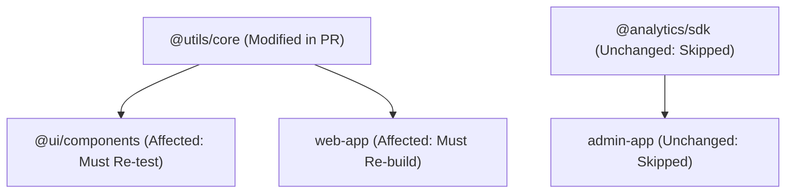

# Monorepo CI/CD

### Question 9029f2a8-7418-420b-8c52-c5e29832c721

- A monorepo containing 12 packages and 3 web apps takes 48 minutes on every PR because CI runs `pnpm test` and `pnpm build` across the entire workspace. How does **Affected-Only Execution (Graph Traversal)** resolve this scaling wall?

### Answer

- **The Monorepo Scaling Wall**: Building and testing every package on every commit creates an `O(N)` pipeline duration that inevitably hits an unbearable ceiling around 5–10 packages.
- **Affected-Only Graph Traversal (Turborepo / Nx)**:
  - Tooling builds an internal Directed Acyclic Graph (DAG) of workspace dependencies (e.g., `web-app` depends on `@ui/components`, which depends on `@utils/core`).
  - Computes the git diff between the current PR branch and `origin/main`.
  - Determines the exact subset of packages that changed **plus any downstream consumers that depend on them**.
  - Unrelated packages and their downstream dependencies are completely excluded from the CI execution plan.
- **Example syntax**: `turbo run test build --filter=...[origin/main]` instructs Turborepo to run `test` and `build` only for packages modified since `origin/main` and all packages that depend on them.



- [More detail on Turborepo Filtering and Affected Tasks](https://turbo.build/repo/docs/core-concepts/monorepos/filtering)

---

### Question c22a0ffc-ef1e-4a5a-8cca-28081fd32b73

- How do you configure independent **Per-App Deployment Pipelines** in a single monorepo so that modifying a marketing site does not trigger a production deployment of the main web app?

### Answer

- **The all-or-nothing deploy anti-pattern**: Triggering full production deployments for all applications on every merge to `main` inflates blast radius, creates false incident alarms, and exhausts deployment rate limits.
- **Path-scoped CI workflow triggers**:
  - Split monolith workflow files into dedicated per-application workflows (e.g., `.github/workflows/deploy-web.yml`, `.github/workflows/deploy-admin.yml`).
  - Use GitHub Actions `on.push.paths` filters or Turborepo filter logic to restrict execution.
  - A workflow only triggers if commits alter files inside the application's root directory **or within shared workspace packages it explicitly consumes**.

```yaml
# .github/workflows/deploy-web.yml
# ✅ Scoped trigger: only deploys web app when itself or its shared dependencies change
name: Deploy Web App
on:
  push:
    branches: [main]
    paths:
      - 'apps/web/**'
      - 'packages/ui/**'
      - 'packages/utils/**'
      - 'pnpm-lock.yaml'

jobs:
  deploy:
    runs-on: ubuntu-latest
    steps:
      - uses: actions/checkout@v4
      - run: pnpm turbo run build --filter=web...
      - run: pnpm run deploy:web
```

- [More detail on GitHub Actions Workflow Path Filtering](https://docs.github.com/en/actions/using-workflows/workflow-syntax-for-github-actions#onpushpull_requestpull_request_targetpathspaths-ignore)

---

### Question 5e6a3ee8-3b3f-4aeb-b0d0-0e83038102d6

- How does **Changesets** automate semantic versioning, changelog generation, and package publishing in a multi-package monorepo, and what is the role of **Canary Pre-releases**?

### Answer

- **The monorepo publishing challenge**: When 20 developers edit shared components across multiple packages, tracking semver bumps (`major`, `minor`, `patch`), determining release ordering, and writing changelogs manually causes release friction and breaking changes.
- **Changesets workflow**:
  1. **Developer intent declaration**: When a developer creates a PR touching a package, they run `pnpm changeset` locally, prompting them to select affected packages, choose semver bump type, and write a summary. A small markdown changeset file is committed with the PR.
  2. **Automated versioning PR**: On merge to `main`, a GitHub Action collects all changesets and automatically creates a `"Version Packages"` PR that updates package versions in `package.json` and updates `CHANGELOG.md` across the repo.
  3. **Publishing on merge**: Merging the Version PR triggers `changeset publish` to push new versions to npm or internal registries.
- **Canary Pre-releases (Snapshot tags)**:
  - Allows developers to publish temporary snapshot versions (e.g., `@ui/button@0.0.0-canary-pr124-abc`) directly from an open PR.
  - Consuming applications can install the canary package in their preview environments to verify integration before merging the upstream package change.

```bash
# Generating a snapshot canary package for pre-merge testing
pnpm changeset version --snapshot canary
pnpm changeset publish --tag canary
```

- [More detail on Changesets Monorepo Versioning](https://github.com/changesets/changesets)
