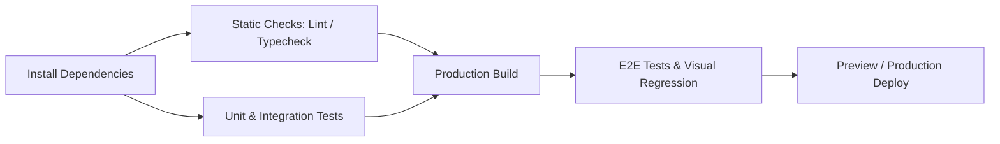

# Pipeline Design for Frontend

### Question 25fcd901-cc3a-44d1-a717-e18a2da73b7b

- Your team's CI pipeline runs for 35 minutes before failing on an ESLint syntax error. How should pipeline stages be architected according to **fail-fast economics**?

### Answer

- **Fail-fast principle**: Run the fastest, cheapest, and most likely-to-fail checks earliest in the pipeline to provide immediate developer feedback and conserve compute credits.
- **Flawed sequential execution**: Running slow, expensive steps (e.g., Docker container packaging or 20-minute E2E suites) before trivial static checks guarantees wasted developer time and pipeline queue congestion.
- **Canonical stage anatomy**:
  1. **Install & Cache Restore**: Restore cached `node_modules` and ensure locked dependencies (`npm ci` / `pnpm install --frozen-lockfile`) (~1–2 min).
  2. **Fast Static Analysis (Parallel)**: Concurrently execute `typecheck`, `lint`, and formatting checks (~1–3 min). Fail immediately on typos.
  3. **Unit & Integration Tests**: Run in-memory tests (Vitest/Jest) (~2–4 min).
  4. **Production Build**: Compile Next.js/Vite bundles (`next build`) (~3–6 min).
  5. **Heavy Verification (E2E / Visual)**: Run Playwright/Cypress suites against the compiled build only if stages 1–4 passed.
  6. **Deploy & Post-Deploy Smoke**: Preview/production deploy followed by synthetic health assertions.



- [More detail on Deployment Pipeline Anatomy](https://martinfowler.com/articles/continuous-integration.html#anatomy-of-a-ci-pipeline)

---

### Question aff7f14c-8768-4bc2-b7be-f96748aa7449

- A pipeline contains 8 distinct verification jobs and takes 24 minutes wall-clock time. How do you re-architect the workflow for **parallelization**, and what is the trade-off between total CPU minutes and wall-clock duration?

### Answer

- **Wall-clock time vs. job count**: Developers wait for wall-clock time (completion of the critical path), not total aggregate CPU minutes.
- **Parallelizing independent stages**:
  - Jobs with zero mutual dependencies (e.g., `eslint`, `tsc --noEmit`, and `vitest`) should run as concurrent sibling jobs on separate runner instances.
  - Wall-clock duration collapses to `max(lint, typecheck, unit)` instead of `lint + typecheck + unit`.
- **The compute cost tradeoff**: Running 4 parallel runners for 4 minutes costs the same billable compute minutes (16 minutes) as running 1 runner for 16 minutes on GitHub Actions, while cutting developer wait time by 75%.
- **Dependency orchestration**: Use explicit `needs: [...]` declarations so heavy build and E2E jobs only trigger after all upstream parallel static gates succeed.

```yaml
# ✅ Parallel static checks unblocking build only when all pass
jobs:
  lint:
    runs-on: ubuntu-latest
    steps:
      - run: pnpm lint
  typecheck:
    runs-on: ubuntu-latest
    steps:
      - run: pnpm typecheck
  unit-test:
    runs-on: ubuntu-latest
    steps:
      - run: pnpm test:unit

  build:
    needs: [lint, typecheck, unit-test]
    runs-on: ubuntu-latest
    steps:
      - run: pnpm build
```

- [More detail on GitHub Actions Job Dependencies](https://docs.github.com/en/actions/using-jobs/using-jobs-in-a-workflow#defining-prerequisite-jobs)

---

### Question 165735d5-0450-4332-a4bd-335187115fbe

- In a repository with 50+ engineers, pull requests pass CI individually but frequently break `main` immediately after merging. What causes this, and how does a **Merge Queue** resolve it?

### Answer

- **The phantom green PR race**:
  - PR A and PR B are both branched from commit `C1` on `main`.
  - Both PRs run CI against `C1` and turn green.
  - PR A merges into `main` (creating commit `C2`). PR B merges immediately after without re-running CI against `C2`.
  - If PR A renamed a shared function that PR B calls, `main` breaks even though both PRs had green checks individually.
- **Merge Queue mechanics**:
  - Instead of allowing direct merges, engineers submit approved PRs into a queue.
  - The queue automatically creates a temporary merge commit (`main + PR A + PR B`), runs CI on the integrated state, and merges sequentially.
  - If tests fail, the offending PR is ejected from the queue automatically, keeping `main` pristine.
- **When is it worth the friction**: Essential for teams with >20 active contributors and high commit velocity; unnecessary overhead for small teams where branch protection with "Require branches to be up to date before merging" suffices.

- [More detail on GitHub Merge Queue](https://docs.github.com/en/repositories/configuring-branches-and-merges-in-your-repository/configuring-pull-request-merges/managing-a-merge-queue)

---

### Question cec68d4e-db3a-40b9-8f16-d302a6672cc2

- When designing matrix builds for frontend E2E suites, what criteria dictate whether to test across a wide matrix (browsers, viewports, Node versions) versus a minimal subset?

### Answer

- **Matrix build cost explosion**: Testing 3 browsers (Chromium, Firefox, WebKit) × 3 viewports (desktop, tablet, mobile) × 2 Node versions = 18 matrix jobs per PR. This balloons CI costs and stalls delivery.
- **Senior cost/benefit judgment**:
  - **Node versions**: Never matrix Node versions on frontend application PRs. Pin the exact production Node version via `.nvmrc` or `package.json` `engines`. Reserve Node matrices strictly for open-source library authors.
  - **PR vs. Nightly split**:
    - **Per-PR Gate**: Run fast, high-signal tests on **Chromium only** with standard desktop and mobile viewports (<5 min).
    - **Scheduled / Pre-merge Matrix**: Run cross-browser (Firefox, Safari/WebKit) and tablet viewports nightly or strictly on merges to `main`.
- **Justification**: >95% of frontend logic regressions are cross-platform JavaScript errors caught by Chromium; browser-specific rendering bugs can be caught in scheduled runs without imposing a 30-minute tax on every PR.

```yaml
# ✅ High-velocity PR gate running only primary browser; matrix reserved for nightly
jobs:
  e2e-pr:
    if: github.event_name == 'pull_request'
    runs-on: ubuntu-latest
    steps:
      - run: npx playwright test --project=chromium-desktop --project=chromium-mobile
```

- [More detail on Playwright CI Multi-Browser Strategy](https://playwright.dev/docs/ci#best-practices)
