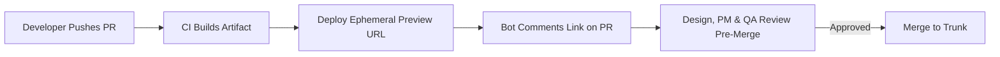

# Preview Deployments

### Question 4fdc6852-093c-441a-9de0-ff52cf27ba97

- Why are **Preview Deployments (Ephemeral Per-PR Environments)** considered the defining frontend CI/CD advantage, and how do they shift QA and design review left?

### Answer

- **The staging environment bottleneck**: Traditional setups have a single shared "staging" environment. Multiple features queued for testing overwrite staging, blocking testers, causing data conflicts, and making it impossible to verify isolated branch changes.
- **Preview deployment mechanics**:
  - Every git push to a pull request triggers an automated build and creates a unique, immutable URL (e.g., `https://my-app-git-feat-checkout-acme.vercel.app`).
  - A CI bot automatically posts the preview URL directly into the PR description or comments.
- **Shifting review left**:
  - **Design & UX review**: Product designers inspect actual responsive styling, animations, and micro-interactions on real devices prior to code merge.
  - **Stakeholder sign-off**: Product Managers test acceptance criteria without needing to pull git branches or run local Node servers.
  - **Isolated bug verification**: Multiple QA testers verify independent features concurrently without mutual interference.



- [More detail on Vercel Preview Deployments](https://vercel.com/docs/deployments/preview-deployments)

---

### Question 027d07be-a73b-4683-8d2c-e6fc5a3a140d

- A team enables preview deployments, but QA reports that every preview displays blank screens or network errors because backend APIs reject the preview domain. What **Preview Data & API Strategy** solves this?

### Answer

- **Previews without data test nothing**: An isolated frontend shell cannot be verified without functional backend APIs, authenticated sessions, and realistic data.
- **Architectural solutions for preview environments**:
  1. **Branching Databases (Neon / Supabase / PlanetScale)**: CI spins up an isolated, copy-on-write database branch seeded with sanitized test data matching the PR branch lifecycle, torn down automatically when the PR closes.
  2. **Dedicated Staging API with CORS wildcards**: Backend staging services configure CORS and cookie domain policies to accept requests from dynamic preview subdomains (`*.preview.domain.com`).
  3. **Mock Service Worker (MSW) / Mock Mode fallback**: For PRs touching frontend-only logic ahead of backend implementation, allow a preview build toggle (`NEXT_PUBLIC_MOCK_API=true`) that intercepts network requests via MSW with realistic fixtures.
  4. **Mocked / Bypass Auth Provider**: Configure preview auth (e.g., Clerk / Auth0 test tenants) with deterministic test credentials so QA and external stakeholders can authenticate without enterprise SSO barriers.

- [More detail on Branching Databases for Previews](https://neon.tech/docs/guides/branching)
- [More detail on Mock Service Worker in Previews](https://mswjs.io/)

---

### Question dd4d366e-ff4d-42fb-9605-6a3abdee611b

- How can preview deployments be leveraged as a testing target for automated **Playwright E2E Suites** within the same PR pipeline run?

### Answer

- **Testing against true production-like infrastructure**: Running E2E tests against `localhost` on a GitHub runner misses edge routing, CDN headers, middleware redirects, and real asset resolution bugs.
- **Pipeline orchestration workflow**:
  1. Deploy the PR branch to an ephemeral preview environment.
  2. Wait for deployment readiness (poll provider deployment status API or use GitHub deployment webhooks).
  3. Extract the resulting preview URL (`BASE_URL=https://pr-123.preview.domain.com`).
  4. Execute Playwright E2E suites targeting the live preview URL over HTTPS.
  5. If E2E tests fail, mark the PR status check red and preserve traces.

```yaml
# ✅ Running Playwright against live ephemeral preview deployment
jobs:
  e2e-preview:
    runs-on: ubuntu-latest
    steps:
      - uses: actions/checkout@v4
      - name: Await Preview URL
        id: preview
        uses: patrickedqvist/wait-for-vercel-preview@v1.3.1
        with:
          token: ${{ secrets.VERCEL_TOKEN }}
          max_timeout: 300
      - name: Run Playwright against Preview
        run: npx playwright test
        env:
          BASE_URL: ${{ steps.preview.outputs.url }}
          TEST_USER_PASSWORD: ${{ secrets.TEST_USER_PASSWORD }}
```

- [More detail on Testing Preview Deployments with Playwright](https://playwright.dev/docs/test-webserver#testing-against-production-or-staging)

---

### Question 86cfb24a-dd3d-482b-9bbd-223eaf557ece

- What **Security and Cost Hygiene** risks arise when running preview deployments across a 40-engineer organization, and how do you mitigate them?

### Answer

- **Security Risks & Mitigations**:
  - **Exposing internal features to the public web**: Preview URLs are public unless protected. Attackers scrape DNS and search indices.
    - *Mitigation*: Enforce **Vercel Deployment Protection** / Cloudflare Access (SSO / password wall) on all preview deployments, and set `X-Robots-Tag: noindex, nofollow` to prevent search engine indexing.
  - **Leaking Production Secrets**: Injecting production database connection strings or production Stripe keys into preview builds.
    - *Mitigation*: Strictly isolate preview environment variable scopes. CI secret managers must never expose production secrets to non-main branches.
- **Cost & Hygiene Risks & Mitigations**:
  - **Runaway serverless compute & build queues**: 40 engineers pushing 10 commits a day triggers 400 preview builds daily, exceeding platform concurrency limits and racking up bandwidth fees.
    - *Mitigation*: Implement **GitHub Actions concurrency groups** (`cancel-in-progress: true`) to automatically cancel in-flight builds when a new commit is pushed.
    - *Auto-teardown*: Configure automated branch cleanup to destroy associated ephemeral preview environments and DB branches immediately upon PR merge or closure.

```yaml
# ✅ Canceling obsolete in-flight preview builds on rapid commits
concurrency:
  group: preview-${{ github.ref }}
  cancel-in-progress: true
```

- [More detail on GitHub Actions Concurrency Control](https://docs.github.com/en/actions/using-jobs/using-concurrency)
