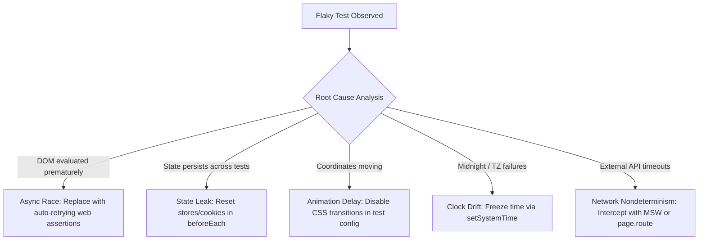
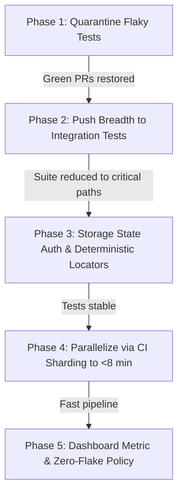

# Flakiness — Root Causes & Fixes

### Question b408448f-d198-470d-8368-6244bc466644

- What is the **flakiness taxonomy** in frontend and E2E testing, and why is flakiness fundamentally an engineering correctness bug rather than "bad luck"?

### Answer

- **Flake is a defect**: A test that passes 9 times and fails once is not unlucky; it exposes an unhandled race condition, leaking state, or unmanaged timing assumption. The same nondeterminism that causes CI flake will manifest as intermittent UI bugs for real users.
- **The 6 Primary Flake Root Causes**:
  1. **Async Race Conditions (Missing waits)**: Asserting DOM state before an asynchronous event, promise resolution, or animation completes (e.g., evaluating boolean `isVisible()` before the element finishes mounting).
  2. **Shared State Leaks**: Global store mutations (Zustand/Redux), uncleared cookies, or shared database rows persisting across test boundaries.
  3. **Animation & Transition Jitter**: Interacting with an element while a CSS translate/fade transition is actively moving its click coordinates.
  4. **Time & Timezone Dependencies**: Tests relying on `new Date()` that fail only when CI runs across midnight or in UTC vs local timezone.
  5. **Network Jitter & Unmocked Third Parties**: Depending on live external endpoints (Stripe, Google Maps) that suffer latency spikes or rate limits.
  6. **Resource Contention in CI**: CPU throttling on multi-core runners causing background threads to execute slower than on developer MacBooks.



- [More detail on Flaky Tests at Google](https://testing.googleblog.com/2016/05/flaky-tests-at-google-fact-or-fiction.html)
- [More detail on Playwright Flakiness Prevention](https://playwright.dev/docs/test-retries)

---

### Question 7b2f2062-a794-4a48-aaed-0d318cb4adc9

- Why is the **"Just Retry" policy** (`retries: 3`) considered an anti-pattern, and what is the proper engineering discipline for **Quarantine Lanes**?

### Answer

- **The danger of unmonitored retries**:
  - Automatically retrying failed tests until they turn green hides real race conditions, memory leaks, and sporadic server crashes.
  - Furthermore, 3 retries on a slow suite turn a 20-minute CI pipeline into a 60-minute bottleneck.
- **The Senior Quarantine Discipline**:
  1. **Stop the bleeding**: When a test flakes repeatedly, move it out of the blocking PR gate into an isolated **Quarantine Suite** (`test.fixme` or tag `@quarantine`).
  2. **Keep PR builds trustworthy**: Developers must trust that a red build strictly means broken code, not test flake.
  3. **Continuous Quarantine Run**: The quarantined tests run on a cron schedule to gather failure traces without blocking PR merges.
  4. **Strict SLA / Ownership**: Quarantined tests must be assigned a Jira ticket and fixed within a 1-week SLA, or permanently deleted. Tests left in quarantine indefinitely become dead code.

```typescript
// playwright.config.ts - Quarantining flaky tests out of PR blocking gate
export default defineConfig({
  // In PR pipelines: zero tolerance for flake; trace immediately on failure
  retries: process.env.CI ? 0 : 0,
  grepInvert: /@quarantine/, // Exclude quarantined tests from blocking PR gate!
  use: {
    trace: 'retain-on-failure',
  },
});
```

- [More detail on Test Quarantine by Martin Fowler](https://martinfowler.com/articles/practical-test-pyramid.html#TestQuarantine)
- [More detail on Flaky Test Management](https://playwright.dev/docs/test-retries#quarantine-flaky-tests)

---

### Question 3d3c2b13-60e7-407f-b4dd-26277d93e165

- What is the step-by-step **diagnostic workflow** for isolating and fixing a flaky test that passes locally but fails intermittently in CI?

### Answer

- **Step 1: Reproduce via repetition (`--repeat-each`)**
  - Run the single test 50 to 100 times in isolation to prove the failure is reproducible:
  - `npx playwright test my-test.spec.ts --repeat-each=50 --workers=4`
- **Step 2: Check for test ordering leaks (Bisection)**
  - If the test passes 100 times in isolation but fails when run in the full suite, it is a **victim of state pollution**.
  - Run tests with random ordering (`--shuffle`) or bisect the suite to identify which prior test leaves residual storage, cookies, or database records.
- **Step 3: Inspect the forensic trace artifact (Trace Viewer)**
  - Never guess or add print logs. Open the Playwright Trace (`trace.zip`).
  - Step through the timeline snapshot immediately preceding the failure to see what was in the DOM, what network requests were pending, and whether an overlay blocked clicks.
- **Step 4: Stabilize via deterministic primitives**
  - Replace manual timeouts with web-first assertions. Freeze time with `fakeTimers`. Intercept external network calls.

```bash
# 1. Stress-test local execution to trigger race conditions
npx playwright test tests/checkout.spec.ts --repeat-each=100 --workers=8

# 2. Inspect Playwright Trace Viewer for exact DOM snapshot on failure
npx playwright show-trace test-results/checkout-trace.zip
```

- [More detail on Playwright Trace Viewer](https://playwright.dev/docs/trace-viewer)
- [More detail on Diagnosing Flaky Tests](https://playwright.dev/docs/test-retries#troubleshooting-flaky-tests)

---

### Question 81163275-1556-4d73-b883-ff3230fee05c

- [Staff-Level Case Study] Your company's E2E test suite is **30% flaky, takes 65 minutes to run, and developers routinely merge on red builds**. What is your 5-phase turnaround strategy?

### Answer

- **Phase 1: Stop the Bleeding (Restore Trust)**
  - Quarantine all known flaky tests immediately into a non-blocking scheduled suite. PR gates must become 100% reliable and green. "A test suite developers ignore is worse than no suite at all."
- **Phase 2: Audit & Re-scope (Push Down the Trophy)**
  - Audit the 65-minute suite. Identify tests verifying component logic (e.g. form validation errors, dropdown keyboard navigation) and push them down to Vitest / React Testing Library integration tests (running in milliseconds).
  - Strictly limit the E2E suite to the top 10–15 critical revenue flows (signup, checkout, core CRUD).
- **Phase 3: Enforce Architectural Determinism**
  - Replace UI logins with Playwright `storageState` session reuse (saving 20+ minutes).
  - Eliminate all `waitForTimeout()` calls and replace boolean checks with web-first retrying assertions.
  - Isolate test data: mandate unique dynamic entities per test instead of shared databases.
- **Phase 4: Scale via CI Sharding**
  - Split the trimmed suite across 4 to 8 parallel GitHub Actions runner shards (`--shard=x/y`), collapsing wall-clock execution time to under 8 minutes.
- **Phase 5: Instrument & Governance**
  - Track Flake Rate as a core engineering KPI on team dashboards.
  - Implement a policy: any new test that flakes in CI is automatically blocked from merge until stabilized.



- [More detail on Eradicating Non-Determinism in Tests by Martin Fowler](https://martinfowler.com/articles/non-determinism.html)
- [More detail on CI Sharding Strategies](https://playwright.dev/docs/test-sharding)
