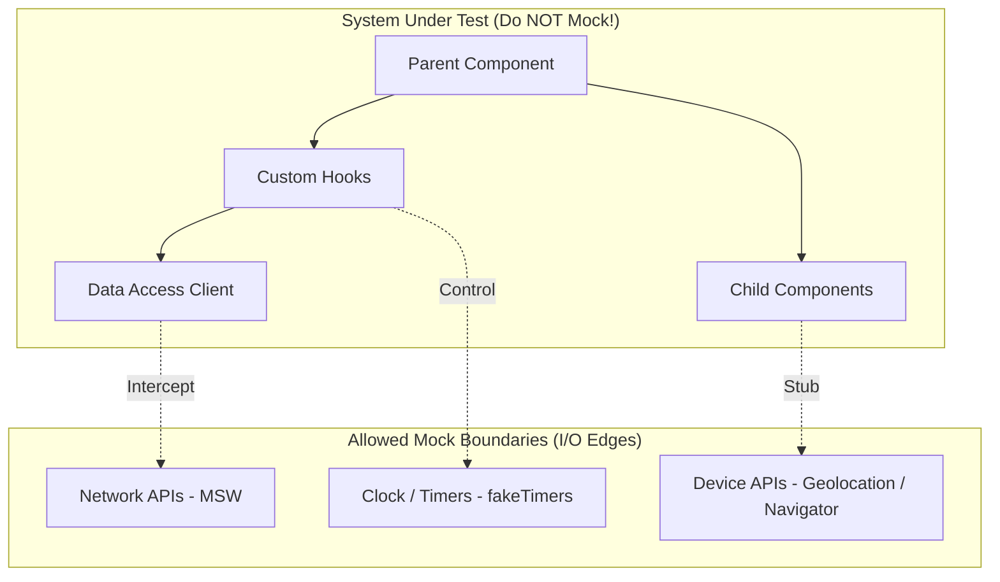

# Mocking & Test Doubles

### Question 8739869f-7b36-4006-b817-185c15c8180a

- What is the precise taxonomy of **Test Doubles** (Dummy, Stub, Spy, Mock, Fake), and why does an in-memory **Fake** provide significantly higher test fidelity than an interaction **Mock**?

### Answer

- **The Test Double Taxonomy**:
  - **Dummy**: Passed around only to satisfy parameter signatures (e.g., empty object or unused callback); never actually read or executed.
  - **Stub**: Provides canned responses to calls made during the test (e.g., returning `{ id: '1' }` when `getUser()` is called), with zero interaction assertions.
  - **Spy**: Wraps a real or stubbed function to record invocation metadata (arguments passed, return values, call frequency).
  - **Mock**: Pre-programmed with expectations about calls it must receive; asserts that specific methods were invoked with exact parameters.
  - **Fake**: A working, simplified implementation with real business behavior, but unsuitable for production (e.g., an in-memory `Map`-backed database repository or localStorage fake).
- **Why Fakes beat Mocks**:
  - Mocks verify *how* code collaborates (coupling tests to method names and call order).
  - Fakes allow stateful multi-step interactions (create user → list users → delete user) without coupling tests to implementation internals. Tests assert state changes against the Fake rather than spying on internal method calls.

```typescript
// ❌ Interaction Mock: Couples test to exact internal method calls
const mockAuthService = {
  validateToken: vi.fn().mockReturnValue(true),
  fetchPermissions: vi.fn().mockReturnValue(['read', 'write']),
};
// Test breaks if developer refactors validateToken to combine with fetchPermissions!

// ✅ In-Memory Fake: Stateful, resilient, preserves behavioral contracts
export class FakeUserRepository implements UserRepository {
  private users = new Map<string, User>();

  async save(user: User): Promise<void> { this.users.set(user.id, user); }
  async findById(id: string): Promise<User | null> { return this.users.get(id) ?? null; }
  async delete(id: string): Promise<void> { this.users.delete(id); }
}
```

- [More detail on Mocks Aren't Stubs by Martin Fowler](https://martinfowler.com/articles/mocksArentStubs.html)
- [More detail on Test Double Taxonomy](https://en.wikipedia.org/wiki/Test_double)

---

### Question 59cbdd6e-e274-41b5-a6ef-f5b15300a4aa

- Why is network-level interception with **Mock Service Worker (MSW)** superior to module mocking (`vi.mock('./api')`), and what critical application layers does module mocking leave completely untested?

### Answer

- **Module mocking bypasses the entire data layer**: When you mock `./api.ts` or `fetchClient`:
  - You bypass HTTP client interceptors (auth token attachment, refresh token retries).
  - You bypass caching strategies (TanStack Query / SWR cache keys and deduplication).
  - You bypass serialization/deserialization logic and error-response transformers (mapping 422 to domain form errors).
- **Network-level interception (MSW)**:
  - Intercepts requests at the network transport boundary (Service Worker in browser, interceptor in Node/Vitest).
  - The application executes its real `fetch()`, Axios, or TanStack Query client code path.
  - **Shared artifact value**: The exact same MSW handlers used in Vitest unit tests can be imported into Storybook stories and local development (`msw/browser`), ensuring consistent data mocks across all environments.

```typescript
// ❌ Module Mock: Bypasses headers, error parsing, and TanStack Query integration!
vi.mock('@/api/users', () => ({
  fetchUser: vi.fn().mockResolvedValue({ id: '1', name: 'Alice' }),
}));

// ✅ MSW Handler: Exercises the complete HTTP fetch and serialization pipeline
import { http, HttpResponse } from 'msw';
import { setupServer } from 'msw/node';

export const handlers = [
  http.get('/api/users/:id', ({ params, request }) => {
    // Assert authorization header was sent by real HTTP client
    if (!request.headers.get('Authorization')) {
      return new HttpResponse(null, { status: 401 });
    }
    return HttpResponse.json({ id: params.id, name: 'Alice' });
  }),
];

export const server = setupServer(...handlers);
```

- [More detail on Mock Service Worker Philosophy](https://mswjs.io/docs/philosophy)
- [More detail on Stop Mocking Fetch](https://kentcdodds.com/blog/stop-mocking-fetch)

---

### Question ddacab7f-3946-4c6d-a878-aceaae2af6e7

- Where should **mock boundaries** be placed in a frontend architecture according to the "I/O Edge Principle", and what is the risk of "over-mocked" test suites?

### Answer

- **The I/O Edge Principle**: Only mock at external I/O boundaries where JavaScript interacts with the outside world:
  - Network requests (HTTP APIs, WebSockets) → Mock via MSW.
  - Wall-clock time and timers (`setTimeout`, `Date.now()`) → Mock via `vi.useFakeTimers()`.
  - Browser device APIs (Geolocation, Camera, Web Bluetooth, Clipboard).
  - Non-deterministic math (`Math.random`, crypto UUIDs).
- **The Rule**: **Never mock the unit under test or its internal software collaborators.**
- **The "Over-Mocked" Failure Mode**:
  - If a component test mocks its child components, custom hooks, utils, and state store, the test only verifies that your mock functions return your mock values.
  - When production code changes, the mocks remain static. The test suite stays 100% green while the actual application crashes in production due to broken component integration.



- [More detail on Mocking Boundaries](https://kentcdodds.com/blog/the-testing-trophy-and-testing-classifications#mock-boundaries)
- [More detail on Test Isolation vs Integration](https://martinfowler.com/articles/practical-test-pyramid.html#Mocking)

---

### Question 54dee1c8-165b-4f62-80d6-33fe588e8163

- How do you reliably test time-sensitive logic (debounced search inputs, countdown timers, session timeouts) using **`vi.useFakeTimers()`**, and what is the classic flush-timers pitfall?

### Answer

- **Why fake timers are required**: Waiting for real wall-clock delays (`setTimeout 500ms`) slows down test suites and causes flakiness on resource-constrained CI runners.
- **The Fake Timers discipline**:
  1. Initialize `vi.useFakeTimers()` before the test and restore with `vi.useRealTimers()` in `afterEach()`.
  2. Advance the virtual clock using `vi.advanceTimersByTime(ms)` or `vi.advanceTimersByTimeAsync(ms)` (crucial for React 18+ concurrent scheduling).
- **The Classic Pitfall (`runAllTimers` infinite loop)**:
  - If a component uses continuous `setInterval` or recursive `setTimeout` (e.g., polling or animation frames), calling `vi.runAllTimers()` causes an infinite loop and crashes the test process.
  - **Remedy**: Always advance time by explicit discrete increments (`vi.advanceTimersByTime(300)`).

```tsx
it('triggers search query only after 300ms debounce period', async () => {
  vi.useFakeTimers();
  const searchMock = vi.fn();
  render(<DebouncedSearchBar onSearch={searchMock} />);

  const input = screen.getByRole('textbox', { name: /search/i });
  // Fire input change
  fireEvent.change(input, { target: { value: 'React' } });

  // Clock not advanced yet: handler must NOT have fired
  expect(searchMock).not.toHaveBeenCalled();

  // Advance virtual clock by 299ms: still debounce window
  vi.advanceTimersByTime(299);
  expect(searchMock).not.toHaveBeenCalled();

  // Advance past 300ms threshold
  vi.advanceTimersByTime(1);
  expect(searchMock).toHaveBeenCalledTimes(1);
  expect(searchMock).toHaveBeenCalledWith('React');

  vi.useRealTimers();
});
```

- [More detail on Vitest Fake Timers](https://vitest.dev/api/vi.html#vi-usefaketimers)
- [More detail on Testing Debounced Events](https://testing-library.com/docs/using-fake-timers/)

---

### Question 80e6f535-9b75-4a8f-a4b6-eebdc4de5ea2

- Why does unseeded **randomness and dynamic dates** in component renders cause test flakiness and SSR hydration errors, and how do you enforce determinism?

### Answer

- **The Nondeterminism Hazard**:
  - `Math.random()` or `new Date()` evaluated during component rendering yields different values on the server and client, causing React Hydration Mismatch errors (`Text content does not match server-rendered HTML`).
  - In tests, assertions like `expect(date).toBe('2026-09-17')` pass locally in the developer's timezone but fail on CI servers running in UTC or across midnight boundaries.
- **Enforcing Determinism**:
  1. **Fixed System Clock**: Lock time to a static timestamp using `vi.setSystemTime(new Date('2026-01-01T12:00:00Z'))`.
  2. **Seeded Randomness**: Replace unseeded random ID generators with deterministic seeded PRNGs (or static test fixtures) in tests.

```typescript
beforeEach(() => {
  // ✅ Freeze system clock to deterministic UTC point for all date formatting assertions
  vi.useFakeTimers();
  vi.setSystemTime(new Date('2026-06-15T09:00:00.000Z'));
});

afterEach(() => {
  vi.useRealTimers();
});

it('formats relative timestamp accurately', () => {
  // Component calculating relative time from system clock
  render(<RelativeTimestamp timestamp="2026-06-15T08:30:00.000Z" />);
  expect(screen.getByText(/30 minutes ago/i)).toBeVisible();
});
```

- [More detail on Vitest setSystemTime](https://vitest.dev/api/vi.html#vi-setsystemtime)
- [More detail on React Hydration Mismatches](https://react.dev/reference/react-dom/client/hydrateRoot#handling-different-client-and-server-content)
