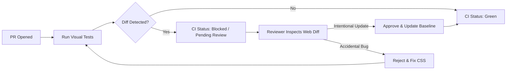

# Visual Regression Testing

### Question 1b035261-c726-40d7-b5b2-69159982c7e9

- What unique failure modes does **Visual Regression Testing** catch that DOM-asserting functional tests (Jest/Vitest/Playwright DOM checks) are fundamentally blind to?

### Answer

- **The DOM blindness paradox**: A DOM-asserting test queries the DOM tree for nodes and text. A button can pass all functional assertions (`toBeInTheDocument()`, `toBeVisible()`) while being visually broken for human users:
  - **CSS Z-Index Collisions**: A modal overlay renders behind a navbar (`z-index: 10` vs `z-index: 50`), rendering modal buttons unclickable.
  - **Container Truncation & Overflow**: `overflow: hidden` on a parent card clips a multiline price string, displaying `$1...` instead of `$1,500.00`.
  - **Color Contrast & Theme Variables**: A CSS variable resolves to `transparent` or `#fff` on `#fff`, rendering text invisible in dark mode.
  - **Responsive Flex/Grid Breakages**: Missing `flex-wrap` causes sidebar columns to squeeze into 5-pixel widths on mobile screens.
- **What visual regression uniquely verifies**: Renders the application in a real headless browser, captures a pixel screenshot, and computes a perceptual diff against an approved baseline image.

```tsx
// ❌ Both of these buttons PASS DOM assertions:
<button style={{ color: 'white', backgroundColor: 'white' }}>Checkout</button>
<button style={{ position: 'absolute', clip: 'rect(0 0 0 0)' }}>Checkout</button>
// In both cases, expect(screen.getByRole('button')).toBeInTheDocument() passes!
// Only visual regression catches that human eyes cannot see or click these buttons!
```

- [More detail on Visual Regression Testing](https://storybook.js.org/docs/writing-tests/visual-testing)
- [More detail on Visual Testing by Kent C. Dodds](https://kentcdodds.com/blog/visual-regression-testing)

---

### Question 29c1d53e-e2c0-4ecd-9a7a-3af810cdeff4

- What is **determinism engineering** in visual testing, and what technical steps are required to eliminate false-positive visual diffs?

### Answer

- **The false-positive crisis**: Visual regression suites fail if even a single pixel shifts anti-aliasing. If 80% of reported visual diffs are false alarms, developers will blindly click "Accept Baseline", destroying the gate's value.
- **Stabilization engineering requirements**:
  1. **Disable CSS animations & transitions**: Set `animation-duration: 0s !important` and `transition-duration: 0s !important` (or Playwright's `animations: 'disabled'`).
  2. **Freeze time and dynamic timestamps**: Replace relative time strings ("2 minutes ago") with static dates (`vi.setSystemTime()`).
  3. **Lock fonts & preload**: Ensure web fonts are self-hosted and fully loaded (`document.fonts.ready`) before taking the snapshot to avoid FOUT (Flash of Unstyled Text) pixel diffs.
  4. **Mask dynamic content**: Mask or blur volatile user content like live avatar URLs, real-time stock charts, or randomized ad banners.
  5. **Deterministic OS rendering**: Run screenshot captures in Linux Docker containers inside CI to avoid font anti-aliasing differences between macOS and Linux.

```typescript
// Playwright snapshot stabilization configuration
test('billing settings snapshot', async ({ page }) => {
  await page.goto('/settings/billing');

  // Ensure fonts and assets are completely rendered
  await page.evaluate(() => document.fonts.ready);

  // Take screenshot with animations disabled and dynamic elements masked
  await expect(page).toHaveScreenshot('billing-settings.png', {
    animations: 'disabled',
    mask: [page.locator('[data-testid="live-credit-card-preview"]')],
    maxDiffPixelRatio: 0.01, // 1% tolerance for cross-GPU anti-aliasing nuances
  });
});
```

- [More detail on Playwright Screenshot Options](https://playwright.dev/docs/test-snapshots)
- [More detail on Stabilizing Visual Tests](https://storybook.js.org/docs/writing-tests/visual-testing#how-to-fix-flaky-visual-tests)

---

### Question 0b6c341b-9c92-4d89-8043-545d7928609e

- What is the architectural tradeoff between **Component-Level Visual Regression (Storybook/Chromatic)** and **Full-Page E2E Visual Regression**, and when is each appropriate?

### Answer

- **Component-Level Visual Regression (Storybook/Chromatic)**:
  - **Mechanism**: Screenshots individual UI components across states (hover, loading, disabled, light/dark mode) rendered in isolated Storybook stories.
  - **Pros**: Fast, isolated, zero network dependencies, pinpoint accuracy (if the Button changes, only the Button story fails).
  - **Sweet Spot**: Design systems, shared component libraries, form inputs, navigation bars.
- **Full-Page E2E Visual Regression (Playwright/Percy)**:
  - **Mechanism**: Screenshots complete browser viewport after navigating through live application routes.
  - **Cons**: High noise ratio. A 1-pixel height change in the header shifts the entire page down, flagging 50 components below it as false regressions.
  - **Sweet Spot**: Key marketing landing pages, legal document renderers, checkout receipt views.
- **The Senior Recommendation**: Invest 90% of visual regression efforts at the component/Storybook layer; restrict full-page visual tests to a small set of static, high-visibility templates.

```
Visual Test Scope Hierarchy:
┌─────────────────────────────────────────────────────────┐
│ Full-Page Visual Tests (5–10 Key Templates)             │
│ - Homepage, Checkout Summary, Invoice View              │
├─────────────────────────────────────────────────────────┤
│ Component Storybook Tests (High Volume & Precision)     │
│ - Design system primitives, Cards, Form controls, Modals│
│ - Tested across themes, RTL, and viewport breakpoints   │
└─────────────────────────────────────────────────────────┘
```

- [More detail on Component-Driven UI Testing](https://www.componentdriven.org/)
- [More detail on Chromatic Visual Review Workflow](https://www.chromatic.com/docs/)

---

### Question c0369ae9-87f2-4624-981c-c2cba9099da3

- How does the **Baseline Review Workflow** operate as a PR quality gate, and how does it distinguish intentional design changes from regressions?

### Answer

- **The Baseline Cycle**:
  1. **Baseline generation**: Every component or page snapshot is compared against the accepted baseline image of the target branch (`main`).
  2. **Diff computation**: CI detects if pixel changes exceed the configured threshold. If diffs exist, the CI gate enters a `pending/failed` check on the GitHub PR.
  3. **Human visual diff review**: Engineers and product designers open the visual dashboard (Chromatic, Percy, or Argos) to inspect side-by-side split screens, onion-skin overlays, and pixel deltas.
- **Two review outcomes**:
  - **Intentional Change (e.g. approved button color rebrand)**: Reviewer clicks "Accept Diff". The new screenshot becomes the new baseline on merge to `main`.
  - **Accidental Regression (e.g. unintended margin shift or broken text wrapping)**: Reviewer rejects the diff, blocking the PR until the CSS issue is resolved.



- [More detail on Visual Testing Workflows](https://storybook.js.org/docs/writing-tests/visual-testing#the-visual-testing-workflow)
- [More detail on Chromatic UI Review](https://www.chromatic.com/features/publish)
